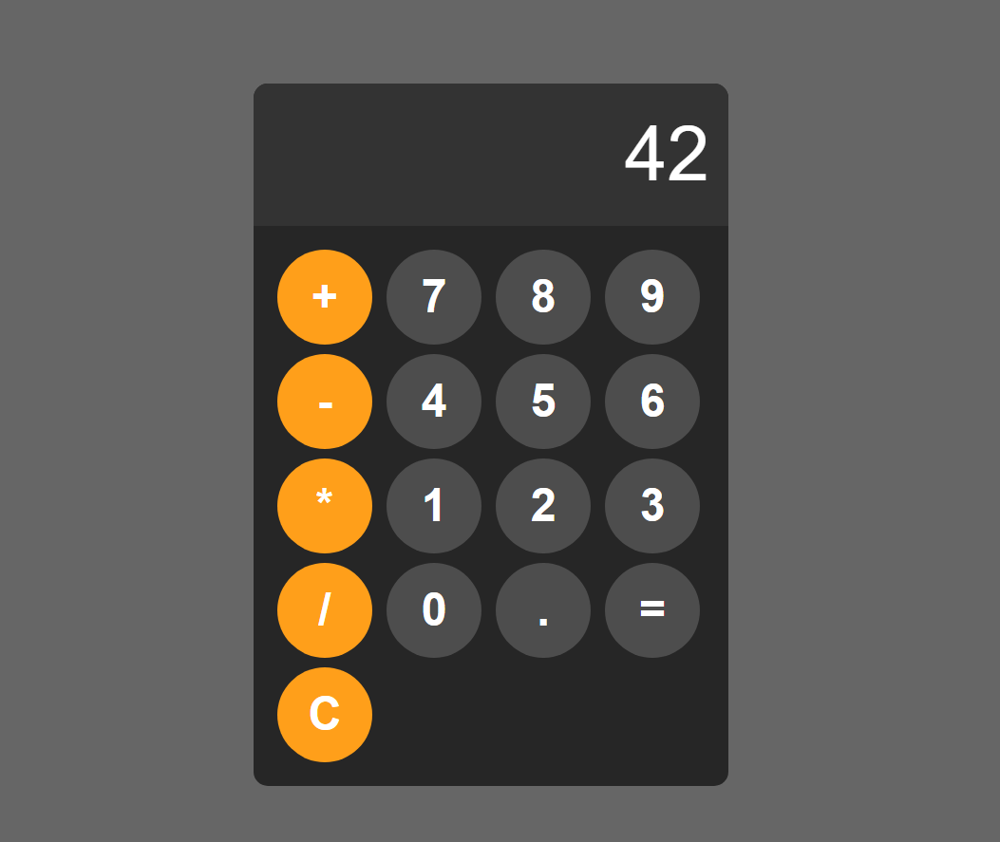

# 🖩 Calculator Web App

A simple calculator web application built with HTML, CSS, and JavaScript. It includes keyboard support.

## 🔧 Features

- Real-time input and output display
- Basic math operations: addition, subtraction, multiplication, division
- Decimal support
- Keyboard-friendly input with `Enter` for `=`, `Backspace` for delete, and `Escape`for `C`
- Adaptive font size based on expression length
- Responsive layout for desktop and mobile
- Error handling for invalid expressions

## 📸 Screenshot

